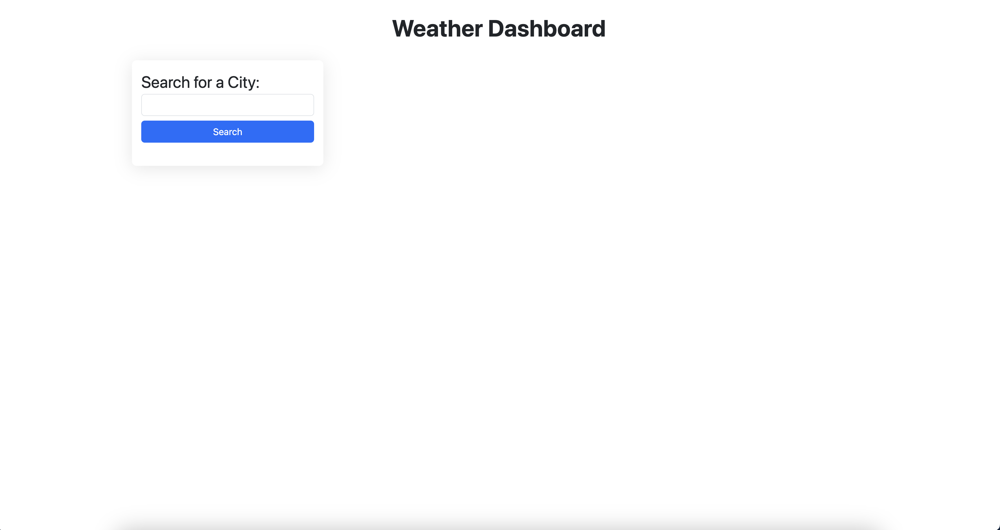

# Server-Side APIs: Weather Dashboard

## Description

Web applications that allow showing the weather and 5-day forecast of cities from the OpenWeather API, stored from the user input in the browser and persisting in localStorage, dynamically updating the HTML and CSS.

## Installation

1. Clone the repository using the SSH key on your local machine with the command `git clone`, followed by the link provided by GitHub
2. Pull the project using the command `git pull`
3. Open the file index.html in your default browser.

## Usage
1. Enter the city you're looking for in the input field.
2. Add as many cities as you want to know.
3. Click on each button to check the weather in the respective city.
4. Refresh the page to check if the data persists.

It should resemble the images below.

## Credits

[FreeCodeCamp | JavaScript Dates – How to Use the DayJS Library to work with Date and Time in JS](https://www.freecodecamp.org/news/javascript-date-time-dayjs/#howtoaddtoorsubtractfromdateandtime)

[StackOverflow | How to method to change HTML background according to API result value?](https://stackoverflow.com/questions/62239945/how-to-method-to-change-html-background-according-to-api-result-value)

[Glassmorphism Generator](https://css.glass/)

[MDN Web Docs| Math.round()](https://developer.mozilla.org/en-US/docs/Web/JavaScript/Reference/Global_Objects/Math/round)

[MDN Web Docs| Element: hasAttribute() method](https://developer.mozilla.org/en-US/docs/Web/API/Element/hasAttribute)

[MDN Web Docs| Array.prototype.filter()](https://developer.mozilla.org/en-US/docs/Web/JavaScript/Reference/Global_Objects/Array/filter)

[GeeksforGeeks | Copy Array Items into Another Array in JavaScript](https://www.geeksforgeeks.org/copy-array-items-into-another-array-in-javascript/)

## License

This blog is open-source and available under the MIT License.
